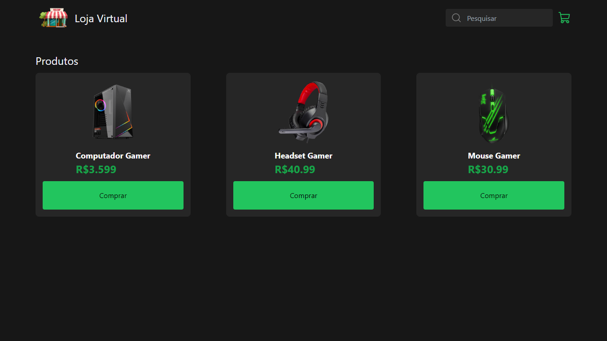

<h1 align="center"> E-Commerce </h1>

Loja virtual fictícia.  

  

 

  <h3 align='center'>Web</h3>
  

## ⚠ Status

 - Em desenvolvimento ⚠

## 👨🏼‍💻 Funções

 - Context API
 - Barra de pesquisa (implementação futura)

## 🚀 Tecnologias

Esse projeto foi desenvolvido com as seguintes tecnologias:

- React
- Typescript
- Tailwindcss
- Phosphor React
- Git e Github

## 💻 Projeto

Este projeto é uma loja virtual fictícia, o principal objetivo é trabalhar com Context API e ter um projeto pessoal mais próximo ao mercado de trabalho.

- [Acesse o projeto finalizado, online](https://e-commerce.vercel.app)

## :memo: Licença

Esse projeto está sob a licença MIT.
